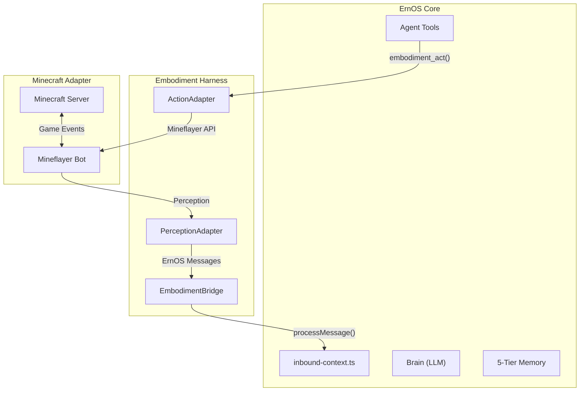

# Generalized Embodiment Harness

ErnOS can **inhabit virtual environments** as a physical agent. The Embodiment Harness treats virtual worlds as just another communication channel — identical in architecture to Discord, Telegram, or WhatsApp.

## Architecture



## Design Principles

1. **Virtual World = Another Channel**: Game events are normalized into ErnOS messages via `inbound-context.ts`.
2. **Actions = Tools**: Mineflayer actions are exposed as standard ErnOS agent tools.
3. **Memory Flows Naturally**: In-game experiences write to the Knowledge Graph, Lessons, and Tape.
4. **Adapters are Swappable**: Implement `EmbodimentAdapter` for any environment (Roblox, Godot, robotics).

## EmbodimentAdapter Interface

Any virtual environment implements this interface to become an ErnOS body:

```typescript
interface EmbodimentAdapter {
  name: string;
  connect(): Promise<void>;
  disconnect(): Promise<void>;
  isConnected(): boolean;
  onPerception(handler: (event: PerceptionEvent) => void): void;
  executeAction(command: ActionCommand): Promise<ActionResult>;
  getWorldState(): Promise<WorldState>;
}
```

## Minecraft Adapter

The first adapter, powered by [Mineflayer](https://github.com/PrismarineJS/mineflayer).

### Perception Events

| Mineflayer Event | → PerceptionEvent Type |
|---|---|
| `chat` | `chat` |
| `health` (decrease) | `health_change` |
| `death` | `death` |
| `entitySpawn` | `proximity` |

### Action Commands

| ActionCommand | → Mineflayer API |
|---|---|
| `goto` | `pathfinder.goto(goal)` |
| `mine` | `collectBlock.collect()` |
| `chat` | `bot.chat(message)` |
| `attack` | `pvp.attack(entity)` |
| `stop` | `pathfinder.stop()` |

### Dependencies

```bash
pnpm add -w mineflayer mineflayer-pathfinder mineflayer-pvp mineflayer-collectblock mineflayer-tool
```

### Quick Start

1. Start a Minecraft Java Edition server (1.21.4) on LAN, port 55916
2. The Minecraft adapter will auto-connect when enabled
3. ErnOS perceives the game world and acts via its standard tool interface

## Agent Tools

| Tool | Description |
|------|-------------|
| `embodiment_act` | Execute any environment action (goto, mine, craft, chat, attack, etc.) |
| `embodiment_observe` | Get world state snapshot (position, health, inventory) |
| `embodiment_navigate` | Pathfind to specific coordinates |
| `embodiment_inventory` | List current inventory items |

## Kernel Integration

The kernel includes **§25.5 EMBODIMENT PROTOCOL** — instructions for how the agent reasons about spatial awareness, perception events, action sequencing, and memory integration of virtual experiences.

## Key Files

| File | Purpose |
|------|---------|
| `src/integrations/embodiment/embodiment-bridge.ts` | `EmbodimentBridge` + `EmbodimentAdapter` interface |
| `src/integrations/embodiment/embodiment-tools.ts` | 4 agent tools with OpenAI-compatible definitions |
| `src/integrations/embodiment/adapters/minecraft-adapter.ts` | Minecraft adapter via Mineflayer |
| `src/integrations/embodiment/adapters/minecraft-profile.json` | Default bot configuration |
| `src/agents/tool-catalog.ts` | Tool registration (embodiment section) |
| `src/agents/prompts/ernos-kernel.ts` | §25.5 EMBODIMENT PROTOCOL |
| `src/auto-reply/reply/inbound-context.ts` | `embodiment:*` channel detection |
