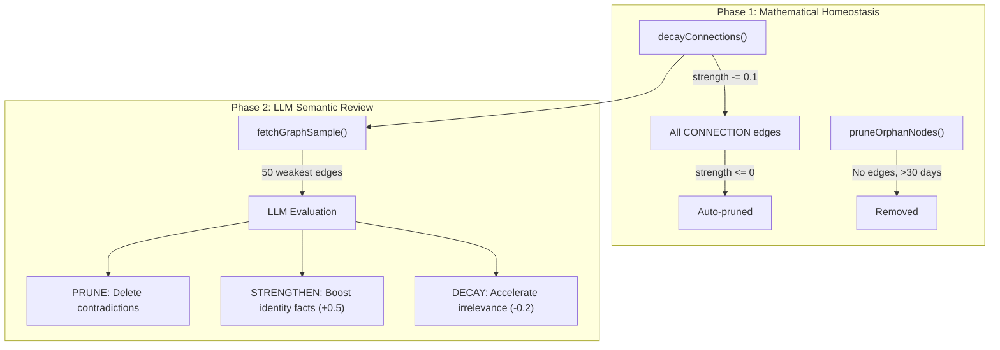

# Dual-Phase Neuroplasticity Engine

ErnOS's Knowledge Graph doesn't just store facts — it **rewires itself** based on usage patterns, combining mathematical synaptic decay with LLM-driven semantic review.

## Architecture

## How It Works

### Phase 1 — Mathematical Decay (Hebbian Homeostasis)
Every nightly Dream Consolidation cycle decrements all `CONNECTION` edge strengths by a configurable decay rate. Edges that reach zero are pruned. Orphan nodes with no relationships older than 30 days are removed.

This mirrors biological **synaptic homeostasis** — the brain's baseline mechanism for forgetting unused connections.

### Phase 2 — LLM Semantic Review (NeuroForm Port)
After Phase 1 runs, surviving edges are sampled and presented to the LLM for autonomous evaluation. The LLM acts as a "prefrontal cortex" issuing three types of commands:

| Command | Biological Analog | What It Does |
|---------|-------------------|--------------|
| `PRUNE` | Synaptic Pruning | Deletes contradictory or outdated edges |
| `STRENGTHEN` | Long-Term Potentiation | Boosts critical identity facts by +0.5 strength |
| `DECAY` | Long-Term Depression | Accelerates irrelevance by -0.2 strength |

### Integration Point
Phase 2 runs as **Step 2.5** in the Dream Consolidation daemon, between mathematical decay (Step 2) and quarantine processing (Step 3).

## Key Files

| File | Purpose |
|------|---------|
| `src/memory/knowledge-graph/neuroplasticity.ts` | `AutonomousNeuroplasticity` class — the Phase 2 engine |
| `src/memory/knowledge-graph/graph-advanced.ts` | `fetchGraphSample()`, `executeLlmGraphAction()` |
| `src/memory/knowledge-graph/types.ts` | `NeuroplasticityDecision` interface |
| `src/cron/dream-consolidation.ts` | Orchestrates both phases nightly |

## Origin
Ported from the [NeuroForm](https://github.com/MettaMazza/NeuroForm) project's Phase 2 neuroplasticity module (`neuroplasticity.py`).
